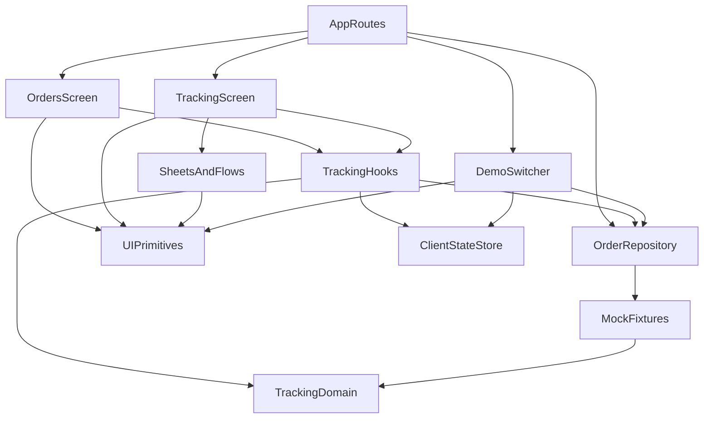

## Stack

TypeScript (strict) · Next.js 16 App Router · React 19 · Tailwind CSS v4 · lucide-react.
Tests: Vitest + Testing Library (unit/component), Playwright + axe-core (E2E, 360/430 px).
No backend — a mock `OrderRepository` with latency and failure injection. Deployed on Vercel.

## Directory map

| path                                  | what lives there                                                                                           |
| ------------------------------------- | ---------------------------------------------------------------------------------------------------------- |
| `src/app/`                            | Thin server routes: `/` (order list), `/orders/[id]` (static params, real 404), error/not-found boundaries |
| `src/features/order-tracking/domain/` | Pure TS: types, Dhaka time math, formatters, status precedence → `deriveTrackingView`                      |
| `src/features/order-tracking/data/`   | `OrderRepository` interface, mock repo, now-relative fixtures, scenario registry, device state             |
| `src/features/order-tracking/hooks/`  | `useTrackingScreen`, `useOrdersList`: compose data + clock + customer state                                |
| `src/features/order-tracking/ui/`     | Screen sections, `sheets/` (support, chat, flows), `states/`, `orders/`                                    |
| `src/features/demo/`                  | Reviewer-only scenario switcher                                                                            |
| `src/components/ui/`                  | Design-system primitives: BottomSheet, Button, Switch, RadioCardGroup, Toast…                              |
| `src/lib/`                            | The single clock, failure-safe localStorage, `useNow`, generic hooks                                       |
| `e2e/`                                | Playwright specs: scenarios, flows, states, a11y, screenshots                                              |
| `docs/`                               | `components/` notes, `screenshots/` for the README                                                         |

## Diagram

## Component index

- [[AppRoutes]]
- [[OrdersScreen]]
- [[TrackingScreen]]
- [[DemoSwitcher]]
- [[TrackingHooks]]
- [[SheetsAndFlows]]
- [[UIPrimitives]]
- [[OrderRepository]]
- [[MockFixtures]]
- [[ClientStateStore]]
- [[TrackingDomain]]

## Entry points

- Dev: `npm run dev` → `src/app/layout.tsx`, `src/app/page.tsx`, `src/app/orders/[id]/page.tsx`
- Prod: `npm run build && npm start` (all routes prerendered; unknown order IDs → 404 via `dynamicParams = false`)
- Live: https://order-tracking-screen-gamma.vercel.app

## Conventions

- **R1** `domain/**` is framework-free — no React/Next/browser globals (ESLint `no-restricted-imports`/`-globals`).
- **R2** Only `src/lib/clock.ts` reads system time; pass `now` (ESLint bans `Date.now()`/`new Date()` elsewhere).
- **R3** UI imports only `domain/view-model` types and hooks — never raw `Order` or `data/` (ESLint).
- **R4** A section renders iff its view-model field exists; no business conditions in JSX.
- **R5** Data only via `OrderRepository` from React context; tests inject a zero-latency repo.
- **R6** Customer actions (case, cancellation, alerts) are `clientState`, never written into `Order`.
- **R8** All dates/money through `domain/format.ts` with explicit `timeZone: 'Asia/Dhaka'` and `formatToParts`.
- **R9** Tone → class via static maps (`components/ui/tones.ts`); never `bg-${tone}`.
- **R10** One sheet at a time (`SheetState` union in `TrackingScreen`); flows snapshot their view model.
- Errors: fetch failures → inline `ErrorState` with retry; render errors → `error.tsx`/`global-error.tsx`; unknown IDs → `not-found.tsx`.
- Files: PascalCase components, camelCase hooks (`useX.ts`), kebab-case domain/data modules; tests colocated `*.test.ts(x)`.

## Where things go

- New scenario: add a fixture in `data/fixtures/orders.ts`, register it in `data/scenarios.ts`, add expectations to `data/fixtures.test.ts` and `e2e/scenarios.ts`.
- New status rule or copy: `domain/status.ts` (facts, precedence) and `domain/derive-tracking-view.ts` (hero/ETA/actions) + tests in `domain/derive-tracking-view.test.ts`.
- New screen section: add an optional field to `domain/view-model.ts`, derive it, render it in `ui/TrackingScreen.tsx` (`TrackingContent`).
- New sheet/flow: component in `ui/sheets/`, a `Sheet` variant + action in `ui/TrackingScreen.tsx`, mutations in `hooks/useTrackingScreen.ts`.
- Real API: implement `OrderRepository` (`data/order-repository.ts`) and export it as `defaultOrderRepository` in `data/index.ts`.
