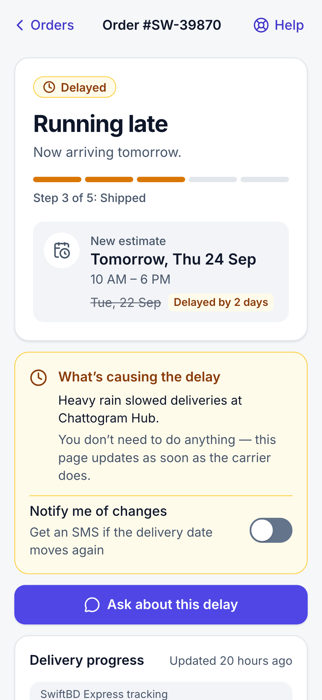
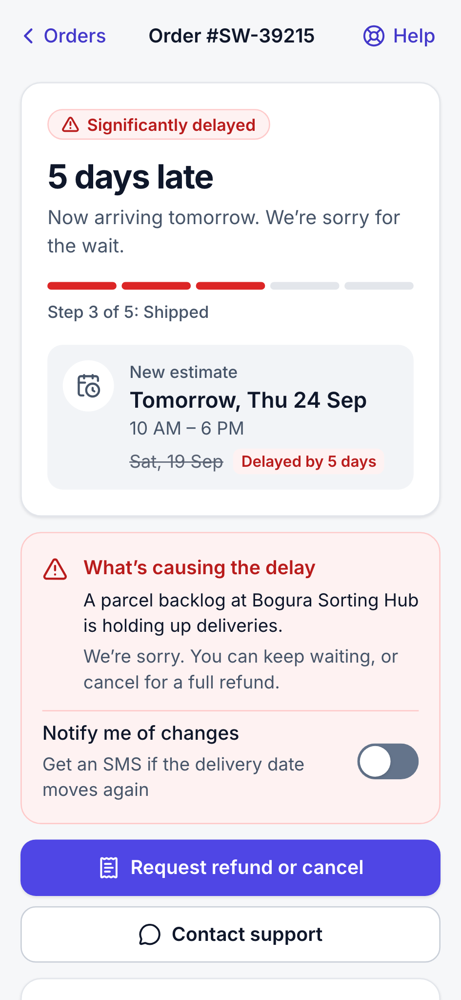
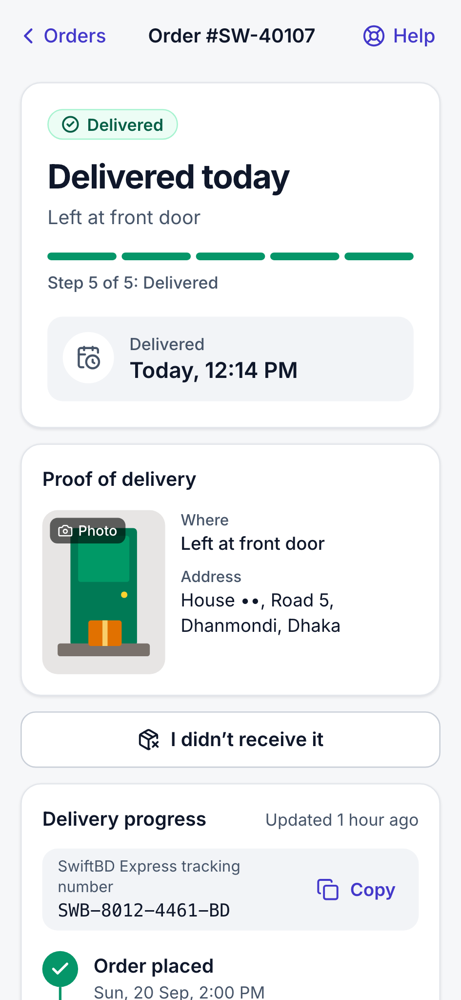
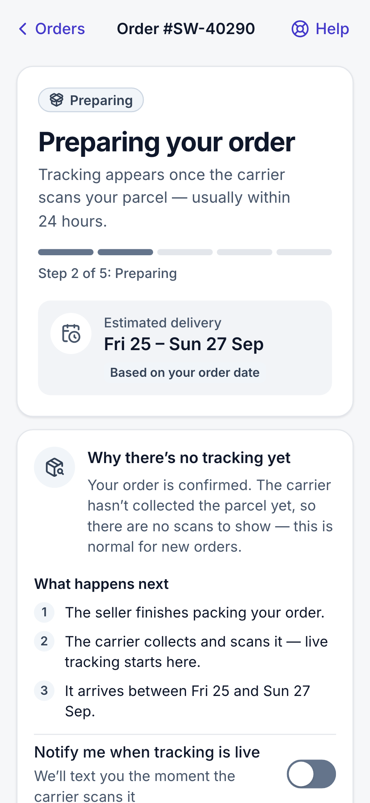

# Order Tracking Screen

A redesigned order tracking experience for mobile, built so a customer can tell **what’s happening, when it arrives, and what to do next** at a glance. The same screen adapts to a delayed order, a parcel marked delivered that never arrived, and an order that has no tracking yet.

**Live demo:** https://order-tracking-screen-gamma.vercel.app
**Repository:** https://github.com/ALPHAMAN-0/Order_Tracking_Screen

> Built for mobile widths of 360–430 px. On a desktop it renders as a centered phone-width column. Use the **Demo** button (bottom-right) to jump between scenarios and force loading, error and empty states.

|                         Running late                          |                              Significantly delayed                              |                           Delivered, not received                           |                      Tracking not available yet                       |
| :-----------------------------------------------------------: | :-----------------------------------------------------------------------------: | :-------------------------------------------------------------------------: | :-------------------------------------------------------------------: |
|  |  |  |  |

---

## Try each situation

Every order is mock data stored as offsets from _now_, so a delayed order stays delayed and a pending one stays pending whenever you open the page.

| Situation                             | What the screen does                                                                                                                                                                                                                                                        | Link                                                                                                 |
| ------------------------------------- | --------------------------------------------------------------------------------------------------------------------------------------------------------------------------------------------------------------------------------------------------------------------------- | ---------------------------------------------------------------------------------------------------- |
| **On track** (baseline)               | “Arriving tomorrow” with a delivery window and the last scan location                                                                                                                                                                                                       | [/orders/SW-40211](https://order-tracking-screen-gamma.vercel.app/orders/SW-40211)                   |
| **Delayed: running late** (1–2 days)  | Amber. The original date is struck through, the new estimate and the carrier’s reason are shown. Offers a “notify me of changes” toggle and a support shortcut.                                                                                                             | [/orders/SW-39870](https://order-tracking-screen-gamma.vercel.app/orders/SW-39870)                   |
| **Delayed: significantly** (≥ 3 days) | Red. Shows “5 days late” with an apology. Offers **Request refund or cancel** (with a confirmation step), or keep waiting with alerts on. Once cancelled, the whole screen switches to “Refund on its way” — no leftover delivery promises.                                 | [/orders/SW-39215](https://order-tracking-screen-gamma.vercel.app/orders/SW-39215)                   |
| **Delivered but not received**        | Shows proof of delivery (the rider’s photo, where it was left, a masked address) and **I didn’t receive it**. That opens a 3-step flow: quick checks, a short report, then a case reference. The screen then shows **Investigation open**, and this persists on the device. | [/orders/SW-40107](https://order-tracking-screen-gamma.vercel.app/orders/SW-40107)                   |
| **Tracking not available yet**        | “Preparing your order”. Explains why there are no scans yet and what happens next, keeps the estimated delivery window and the full timeline, and offers “notify me when tracking is live”. Never an empty screen.                                                          | [/orders/SW-40290](https://order-tracking-screen-gamma.vercel.app/orders/SW-40290)                   |
| **Delivered** (baseline)              | Proof of delivery, with a low-key “Report a problem” link                                                                                                                                                                                                                   | [/orders/SW-38754](https://order-tracking-screen-gamma.vercel.app/orders/SW-38754)                   |
| Loading                               | Skeleton with the same layout, announced to screen readers                                                                                                                                                                                                                  | [?simulate=loading](https://order-tracking-screen-gamma.vercel.app/orders/SW-40211?simulate=loading) |
| Error                                 | Friendly error with **Try again** (which recovers) and support that still works                                                                                                                                                                                             | [?simulate=error](https://order-tracking-screen-gamma.vercel.app/orders/SW-40211?simulate=error)     |
| Not found                             | A real HTTP 404, with a way back                                                                                                                                                                                                                                            | [/orders/SW-00000](https://order-tracking-screen-gamma.vercel.app/orders/SW-00000)                   |
| Empty list                            | “No orders yet”                                                                                                                                                                                                                                                             | [/?simulate=empty](https://order-tracking-screen-gamma.vercel.app/?simulate=empty)                   |

---

## Run it locally

Requires **Node 22** (see `.nvmrc`).

```bash
npm install
npm run dev          # http://localhost:3000
```

| Command                      | What it does                                                                                                                                           |
| ---------------------------- | ------------------------------------------------------------------------------------------------------------------------------------------------------ |
| `npm run dev`                | Development server                                                                                                                                     |
| `npm run build && npm start` | Production build and server                                                                                                                            |
| `npm run lint`               | ESLint (including the architecture boundary rules) and a Prettier check                                                                                |
| `npm run typecheck`          | Next route types and `tsc --noEmit`                                                                                                                    |
| `npm test`                   | Vitest domain, storage and component tests (78 tests)                                                                                                  |
| `npm run test:e2e`           | Playwright on a production build, at 360 px and 430 px: scenarios, flows, states, axe accessibility. Run `npx playwright install chromium` once first. |
| `npm run screenshots`        | Regenerates `docs/screenshots/` at a fixed time                                                                                                        |
| `npm run verify`             | All of the above, in order                                                                                                                             |

CI (GitHub Actions) runs lint, typecheck, unit tests and E2E on every push.

---

## How the redesign addresses the problem

The old screen showed four raw system states. The new one leads with a customer-language answer, then gives the supporting detail:

1. **Status hero.** It shows a status pill (colour, icon and text), a plain-language headline (“Arriving tomorrow”, “Running late”, “5 days late”, “Preparing your order”), a one-line explanation, a 5-step progress bar (“Step 3 of 5: Shipped”) and the delivery estimate. A revised date shows the original struck through.
2. **Context card for the situation.** This is the delay reason, the investigation status, the cancellation confirmation, the tracking-pending explanation, or the proof of delivery.
3. **One clear next action.** Examples: “Ask about this delay”, “Request refund or cancel”, “I didn’t receive it”, “Chat about my case”.
4. **Timeline.** A semantic `<ol>` with done, current and upcoming steps, timestamps, locations, exception notes, a copyable tracking number and the full scan history.
5. **Order summary**, with a details sheet showing items, the price breakdown, payment and address.
6. **Support** is always one tap away (the header **Help** button and a card at the end). The support sheet knows the order and preselects the right topic for the situation. Chat opens an in-app mock conversation pre-seeded with the order. Call is a real `tel:` link, and email is a `mailto:` prefilled with the order and issue.

### Edge-state rationale

- **Delayed.** Say it plainly, say why, and give a new date if there is one. The response scales with severity: 1–2 days late reassures the customer and offers alerts; 3 days or more apologises and hands the decision to the customer (refund or cancel, or keep waiting). If the carrier’s revised date has also passed, the screen says so instead of pretending.
- **Delivered but not received.** Show the evidence first (the photo and where the parcel was left). Next come quick checks that resolve most “missing” parcels, such as reception, neighbours or the household. These checks advise but never block the report. The report itself takes one tap plus an optional note. It returns a case reference, a promised update time and what happens next. The screen then changes from “Delivered” to “We’re looking into it”, so the customer isn’t left looking at a green checkmark for a parcel they don’t have.
- **Tracking not available yet.** Treat it as a normal stage, not an absence of data. The timeline still shows what has happened (placed, preparing), the upcoming steps say “Waiting for the first carrier scan”, and the order-level estimate is kept. The card explains why there are no scans yet and offers an alert. After 48 hours with no scan, a “Taking longer than usual” notice appears.

---

## Architecture

Next.js App Router, TypeScript (strict), Tailwind CSS v4 and lucide-react. There is no backend: a mock repository with latency and failure injection stands in for the API. See [ARCHITECTURE.md](ARCHITECTURE.md) for the map.

```
src/app                        thin server routes: static params, metadata, real 404s
src/features/order-tracking
  domain/   pure TS: types, Dhaka time math, formatters, status rules → TrackingViewModel
  data/     OrderRepository interface, mock repository, now-relative fixtures, device state
  hooks/    compose data + clock + customer state → view model (the UI's only entry point)
  ui/       components that render view models; sheets; loading/error/empty states
src/features/demo              reviewer-only scenario switcher
src/components/ui              design-system primitives (BottomSheet, Button, Switch…)
src/lib                        the single clock, safe localStorage, generic hooks
```

**Rules, enforced by ESLint where possible:**

| Rule                                                                                                                              | Why                                                                              |
| --------------------------------------------------------------------------------------------------------------------------------- | -------------------------------------------------------------------------------- |
| **R1** The domain is framework-free (no React, Next or browser globals)                                                           | The business rules are unit-testable in isolation and portable.                  |
| **R2** Only `lib/clock.ts` reads the system time; everything else receives `now`                                                  | Time-dependent logic is deterministic in tests, and scenarios stay stable.       |
| **R3** `deriveTrackingView({ order, now, clientState })` is the only code that reads raw orders; UI imports view-model types only | Components never branch on status strings, so one screen serves every state.     |
| **R4** A section renders if and only if its view-model field exists                                                               | No hidden business logic in JSX.                                                 |
| **R5** Data goes through `OrderRepository`, supplied through context                                                              | Swapping in a real API touches one file; tests inject a zero-latency repository. |
| **R6** Customer actions (report, cancellation, alerts) are a separate input                                                       | They never mutate the order and persist per order on the device.                 |

**Status precedence** (the first match wins): delivered with an open case → _investigating_; delivered → _delivered_; cancellation requested → _cancelled_; ≥ 3 days late → _severely late_; late or overdue → _late_; no carrier scans → _preparing_; otherwise → _on track_.

**No hydration mismatches by design.** The server renders a time-free shell (the header and a skeleton). The client resolves the “now”-relative data and formats every date explicitly in `Asia/Dhaka`. Strings are built with `formatToParts`, so Node and browser ICU differences can’t leak into the UI. Tests run in a New York time zone to prove it.

**Accessibility:**

- Colour is never the only signal.
- Tap targets are at least 44 px, and inputs use 16 px text so iOS doesn’t zoom.
- Sheets are native `<dialog>` elements with focus return. After a flow completes, focus moves to the resulting banner.
- Timeline steps are announced as “Completed”, “Current step” or “Upcoming”, and the current step has `aria-current="step"`.
- `prefers-reduced-motion` is respected, and light and dark themes are both supported.
- axe runs in E2E with WCAG 2.2 AA tags.

---

## Design decisions and trade-offs

- **Bangladesh-local mock data.** Prices are in ৳, with Dhaka and Chattogram addresses and support hours in Dhaka time. All names are fictional: _Haatbox_ (the store) and _SwiftBD Express_ (the carrier). The support phone number uses an unallocated prefix and the email uses a reserved `.example` domain.
- **Client-side data resolution.** This costs a ~650 ms skeleton, which doubles as the loading-state demo. In exchange there are zero hydration risks and the scenarios never go stale.
- **No state or UI library.** `useSyncExternalStore` covers the clock and localStorage, and native `<dialog>` covers modals. Runtime dependencies are only `lucide-react`, `clsx` and `tailwind-merge`.
- **Persistence is per device** (localStorage). If the browser blocks storage, customer actions still work for the current page session through an in-memory copy. Use **Demo → Reset demo data** to start over.

**Known limitations:**

- `?simulate=notfound` renders the not-found UI with HTTP 200. Real unknown IDs return a true 404.
- Because times are relative, a scenario viewed late at night can show a delivery time of, for example, 3 AM. Screenshots and E2E use a fixed 2 PM Dhaka clock.
